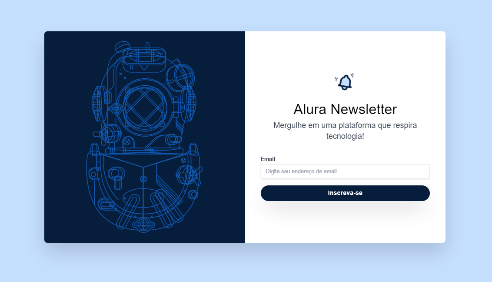

# Tailwind CSS Project

Projeto com o curso Tailwind CSS Alura! Este projeto utiliza o framework Tailwind CSS para criar estilos modernos e responsivos de maneira rápida e eficiente.

## Introdução

Este projeto usa Tailwind CSS em um projeto web para aplicar funcionalidades como responsividade, animações e estilos à uma página Front de NewsLetter ( por enquanto apenas uma página estática). Tailwind CSS é um framework CSS utilitário que permite construir designs customizados diretamente na marcação HTML.

## Instalação

Siga os passos abaixo para configurar o ambiente de desenvolvimento do projeto:

1. Clone este repositório:

    ```bash
    git clone https://github.com/Chikrem/tailwind_css.git
    cd tailwind_css
    ```

2. Instale as dependências do projeto:

    ```bash
    npm install
    ```

## Uso

Para iniciar o servidor de desenvolvimento e visualizar o projeto, utilize o comando:

```bash
npm run dev
```

## Teste

O projeto pode ser visualizado em:

- [Vercel](https://tailwind-css-three-jet.vercel.app/)

## Screenshots

